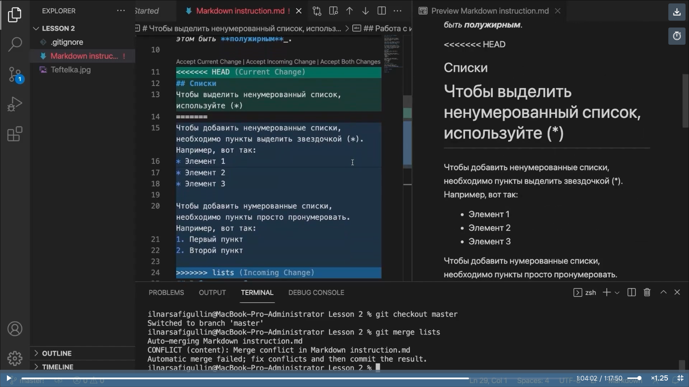

## **Начало работы с Git**
Инициализация локального репозитория
```sh
git init
```
Получение текущего состояния Git
```sh
git status
```
Добавление одного или нескольких *файлов* к индексации
```sh
git add <Имя_файла_1> <Имя_файла_2>
```
Добавление *каталога* к индексации
```sh
git add <Имя_каталога>
```
<u>Также можно добавить к индексации все изменения в текущем каталоге.</u>

Вот так 
>**"Точка" означает "Текущий каталог"**
```sh
git add .
```
Команда для отмены изменений. <u>*Используется не только для отмены коммита или проиндексированного состояния файла.*</u>
```sh
git reset
```
Создание коммита
```sh
git commit -m "Текст коммита"
```
Вывод истории всех коммитов с их хеш-кодами
```sh
git log
```
Просмотр списка веток в репозитории
```sh
git branch
```
Переход к коммиту (по хеш-тегу) или к ветке (по её имени)
```sh
git checkout <хеш-номер> или <имя ветки>
```
Создание новой ветки
```sh
git branch <Имя_ветки>
```
Удаление ветки. **Если в ветке есть неслитые изменения, Git не даст её удалить.**
```sh
git branch -d <Имя_ветки>
```
Для более подробного просмотра изменений можно использовать команду
```sh
git diff
```
Чаще всего эту команду можно использовать чтобы узнать 

что мы ***изменили, но ещё не проиндексировали.***

<font color="green">Команда вводится **после** внесения изменений в рабочий файл и его сохранения, но **до** использования команды ***add*** и создания коммита.</font>

что мы ***уже проиндексировали, но ещё не включили в коммит***

<font color="green">Команда вводится **после** внесения изменений в рабочий файл, сохранения и использования команды ***add***, но **до** создания коммита.</font>

### **Работа с журналом (log)**
Существует множество вариантов отображения журнала изменений  
(можно заглянуть [сюда](https://git-scm.com/docs/git-log "и найти много полезного, но на английском")).

Вот некоторые из них.

Выведем информацию в одну строку.
```sh
git log --oneline
```
Добавим графичекую составляющую. Так лучше видна хронология коммитов.
```sh
git log --graph
```
<font color="green">Отметим ещё несколько интересных флагов.</font>

>***--pretty="..."*** — определяет формат вывода.

>***%h*** — укороченный хеш коммита.

>***%ad*** — дата коммита.

>***|*** — просто визуальный разделитель.

>***%s*** — комментарий.

>***%d*** — дополнения коммита («головы» веток или теги).

>***%an*** — имя автора.

>***--date=short*** — сохраняет формат даты коротким и симпатичным.

Наберём:
```sh
git log --pretty=format:"%h %ad | %s%d [%an]" --date=short
```
Получим примерно следующее:
```sh
2dc2e17 2023-12-14 | Add base commands (HEAD -> work_with_log, master) [Max]
de9f974 2023-12-13 | Create file structure [Max]
5e58bf3 2023-12-13 | Initial commit [Max]
```
Видно, что флаги можно использовать совместно. В нашем примере использованы *--pretty* и *--date*.

<font color="green">Если нужно настроить формат вывода истории по умолчанию, помогут такие команды:</font>
```sh
git config --global format.pretty '%h %ad | %s%d [%an]'
git config --global log.date short
```
<font color="green">Теперь, при вводе команды **git log** журнал будет иметь вид, как в примере выше.</font>
### **Работа с ветками (branch)**
Кроме *отображения списка веток*, их *создания* и "безопасного" *удаления* существует ещё несколько полезных флагов к команде ***branch***.

Принудительное удаление ветки
```sh
git branch -D <Имя ветки>
```
Изменение имени текущей ветки
```sh
git branch -m <Новое_имя_текущей_ветки>
```
Вывод списка всех веток, включая удалённые
```sh
git branch -a
```
или
```sh
git branch --all
```
Выполнить слияние веток можно командой
```sh
git merge
```
Чтобы отменить слияние, нужно добавить флаг *--abort*
```sh
git merge --abort
```
### **Работа с коммитами (commits)**
<font color="green">Немного про индексацию и коммит.</font>

Благодаря тому что Git разделяет индексацию и создание коммита на отдельные шаги, мы можем легко настраивать что запишется в какой коммит.

Например, в рабочем репозитории несколько файлов ("My_best_site.html","read_me.txt","style.css"), которые мы отредактировали и сохранили. Теперь мы хотим проиндексировать и закоммитить все изменения так чтобы файл "read_me.txt" пошёл в один коммит, а "My_best_site.html" и "style.css" - в другой.

Можно сделать так
```sh
git add read_me.txt
git commit -m "Изменения в Read_me"
```
```sh
git add My_best_site.html
git add style.css
git commit -m "Первая версия лучшего сайта!"
```

<font color="green">Интерактивное редактирование комментария.</font>

При использовании команды "commit" с флагом "-m" комментарий создаётся сразу в коммандной строке. Однако флаг "-m" можно опустить. И теперь команда "commit" позволит вам интерактивно редактировать комментарии для коммита.

Редактирование производится в редакторе по выбору. Редактор выбирается из следующего списка (в порядке приоритета):
* переменная среды **GIT_EDITOR**
* параметр конфигурации **core.editor**
* переменная среды **VISUAL**
* переменная среды **EDITOR**

<u>**В *Linux* можно использовать редактор Vim. Ввести комментарий в нём, после чего нажать ":wq" (запись и выход).**</u>

### **Тэги**

### **Конфликты и их разрешения**
При работе в одном и том же проекте в разных ветках может возникнуть ситуация во время слияния веток, когда изменения в одной ветке "накладываются" на данные в другой ветке. Возникает **конфликт**, который предлагается решить пользователю. Та же ситуация возникает при коллективной работе над одним и тем же проектом.


На скриншоте видно несколько предложенных вариантов:
* оставить вариант текущей ветки
* принять вариант сливаемой ветки
* принять оба варианта
* сравнить


## **Удалённые репозитории**
### **Создание**
Для совместной работы над  проектом нужно открыть доступ к своим наработкам и получить доступ к наработкам других участников проекта.

_Клонирование удалённого репозитория_
```sh
git clone <url>
```

Можно использовать различные протоколы для подключения (http, ssh, git (собственный протокол GIT)).

При клонировании можно указать путь, по которому будет создан клон (копия).
```sh
git <Короткое_имя> <Каталог>
```
Либо предварительно перейти в необходимую папку, используя Терминал.

Например
```sh
git clone ssh://john@example.com/path/to/my-project.git 
cd my-project 
# Start working on the project
```
В примере выше по протоколу SSH инициализируется новый репозиторий Git в каталоге my-project на локальной машине. Переходим в рабочий каталог командой **cd**. Расширение **.git** у клонированного репозитория отсутствует. Это означает, что у локальной копии есть рабочий каталог.

